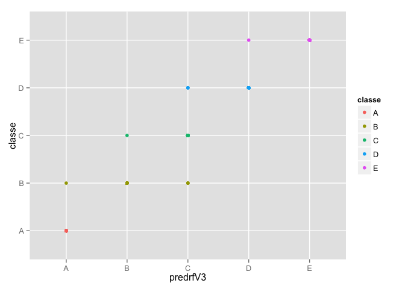

# Machine Learning Prediction Project Writeup
lvillalt  
October 25, 2014  

This project writeup details the analysis on a subset of data obtained for the Coursera Machine Learning Course from  http://groupware.les.inf.puc-rio.br/har.

The goal of the project was to define a model to predict the manner in which the subject performed the exercise measured by the wearable device, from the features provided in the subset.

To respect the word length and number of figures contraints for the assignment, I will dedicate the majority of the writeup to describing the actual model and the analysis.

The initial data exploration focused on determining which features to keep as part of the data set, to avoid problems with some of the model types.

Early on it became obvious from the raw data set that those features that came out of the default `read.csv()` function as factors, had missing data, or NAs, that caused warnings or errors when training some models.

It was decided early on the analysis to remove features or columns that may cause overfitting in out-of-sample data. For example, the name of the subject may be different in the testing data compared to the training set, but that should not limit prediction based on x-y-z sensor data.

The only factor kept was the `new_window` column, the date was removed, as were the names of the subjects, but the timestamps were kept. Additionally, all numeric and integer columns that came out of the `read.csv()` function were kept, except for the row number column `X`. 

To assist with out-of-sample error estimation, and to allow for possible model stacking, the data was partitioned into `buildData` and `validation`, and then the `buildData` was further partitioned into training and testing sets.


```r
training <- read.csv("pml-training.csv")

library(caret)

library(rattle)

set.seed(787)

inBuild <- createDataPartition(y=training$classe, p=0.7,list=FALSE)
validation <- training[-inBuild,]
buildData <- training[inBuild,]
inTrain <- createDataPartition(y=buildData$classe,p=0.7, list=FALSE)
trainset <- buildData[inTrain,]
testset <- buildData[-inTrain,]
testtrain <- trainset[,c(3,4, 6:11, 37:49, 60:68, 86, 113:124, 151:159, 160)]
testtest <- testset[,c(3,4, 6:11, 37:49, 60:68, 86, 113:124, 151:159, 160)]
testval <- validation[,c(3,4, 6:11, 37:49, 60:68, 86, 113:124, 151:159, 160)]
```

While keeping the original partitions, new data sets where `subset` from these. The two most promising models from the data exploration set were a `gbm` model with default parameters, and an `rf` model with 5-fold crossvalidation. The crossvalidation was done inside the `caret` 'train' function, to ensure that all data operations happened inside all of the folds equally. This helps with error estimation.


```r
set.seed(787)
modFitgbm2 <- train(classe ~.,method="gbm", data=testtrain, verbose=FALSE)
set.seed(787)
modFitrf3 <- train(classe ~.,method="rf", data=testtrain, trControl = trainControl(method="cv"),number=5)
```

The analysis started with an `rpart` model with default parameters. The accuracy of this model when predicting on the validation set was around `0.5`. 

A `gbm` model with `pca` preprocessing through the caret 'train' function with default parameters had accuracy around `0.82`.

The `gbm` tried that ended up with the best performance was the one with default parameters, with accuracy values as shown.


```r
predgbm2 <- predict(modFitgbm2, testval)

table(testval$classe, predgbm2)
```

```
##    predgbm2
##        A    B    C    D    E
##   A 1671    3    0    0    0
##   B    2 1136    1    0    0
##   C    0    1 1023    2    0
##   D    0    0    6  956    2
##   E    0    0    0   11 1071
```

```r
modFitgbm2$finalModel
```

```
## A gradient boosted model with multinomial loss function.
## 150 iterations were performed.
## There were 52 predictors of which 37 had non-zero influence.
```

The analysis started with an `rf` model with default parameters. The accuracy of this model when predicting on the validation set was around `0.998`. 

A model with 5-fold crossvalidation through the caret 'train' function with default parameters had similar accuracy in the validation set, but would provide a better estimate of out-of-sample errors.

The model also had better Kappa (`0.9979` vs `0.9974`)


```r
predrf3 <- predict(modFitrf3, testval)

table(testval$classe, predrf3)
```

```
##    predrf3
##        A    B    C    D    E
##   A 1674    0    0    0    0
##   B    1 1135    3    0    0
##   C    0    1 1025    0    0
##   D    0    0    3  961    0
##   E    0    0    0    1 1081
```

```r
modFitrf3$finalModel
```

```
## 
## Call:
##  randomForest(x = x, y = y, mtry = param$mtry, number = 5) 
##                Type of random forest: classification
##                      Number of trees: 500
## No. of variables tried at each split: 27
## 
##         OOB estimate of  error rate: 0.19%
## Confusion matrix:
##      A    B    C    D    E class.error
## A 2735    0    0    0    0 0.000000000
## B    1 1859    1    0    0 0.001074691
## C    0    3 1673    2    0 0.002979738
## D    0    0    6 1570    1 0.004438808
## E    0    0    1    3 1764 0.002262443
```


```r
predgbmV2 <- predict(modFitgbm2, validation)

table(validation$classe, predgbmV2)
```

```
##    predgbmV2
##        A    B    C    D    E
##   A 1671    3    0    0    0
##   B    2 1136    1    0    0
##   C    0    1 1023    2    0
##   D    0    0    6  956    2
##   E    0    0    0   11 1071
```


```r
predrfV3 <- predict(modFitrf3, validation)

table(validation$classe, predrfV3)
```

```
##    predrfV3
##        A    B    C    D    E
##   A 1674    0    0    0    0
##   B    1 1135    3    0    0
##   C    0    1 1025    0    0
##   D    0    0    3  961    0
##   E    0    0    0    1 1081
```


```r
library(ggplot2)

qplot(predrfV3, classe, data=validation, col=classe)
```

 


```r
table(predgbmV2, predrfV3)
```

```
##          predrfV3
## predgbmV2    A    B    C    D    E
##         A 1672    1    0    0    0
##         B    3 1134    3    0    0
##         C    0    1 1024    5    0
##         D    0    0    4  955   10
##         E    0    0    0    2 1071
```

